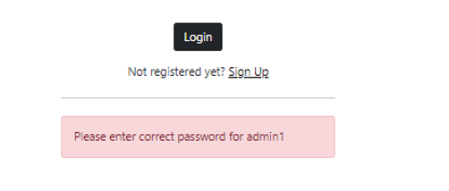
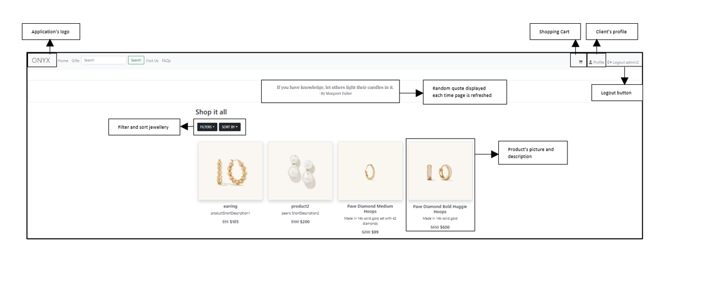

# USER MANUAL

Turcan Madalina, Veronique Karwowska, Shawn Gregory

420-411-VA: eCommerce (Sec 00001)

Saturday, May 16, 2022

# Introduction:

**ONYX** is a web application designed to simulate an online jewelry shop. This program provides common website features such as login, creating a profile, adding to cart and a checkout page that pertain to the customer’s completion of a purchase. The application is programmed using the PHP language and comes with a professional user interface and has a simple design. This user’s manual will provide a detailed explanation of all features included in this web application. 

# Interactive Features

When the user enters the web application, the Home Page is automatically displayed. From here, the user has seven options inside the menu:

*-Home*

*-Gifts*

*-Search*

*-Visit Us*

*-FAQs*

*-Sign Up*

*-Login*

Whenever the client presses on any of them, this will automatically redirect him to the correct web page. To perform certain actions such as adding a product to cart, the user must be a client first. To do so, he needs to either login or register.

 

## Sign Up

If the user chooses to press the Sign-Up link, this will redirect him to the register page where he can create an account.

Inside this page, a form will be displayed where the user will have to enter his username, first name, last name, email, password, and re-confirmed password. This information will be first verified and if any error occurs, the process should be repeated. If the user decides to press the Sign Up without entering any information, this will send him an error message stating that fields cannot be empty.

If the password does not match the reconfirmation password, this will send him an error message that the password does not match.

 

Furthermore, the username of each client should also be unique, otherwise an error message will be displayed during registration process so that user chooses another username.

Finally, if the user has already an account, the client can click on the Login link provided just below so that the user can directly access the login page.

Once the following has been verified and the user click on the Sign Up button, an account will be created and the new member will be redirected to the Home Page.

 

## Sign In

If the user chooses to press on the login link, the Login Page will be forwarded. Here, he will have to enter his username and password and press on the login button. 

Just like for the sign up, the data is first verified and then forwarded. For instance, if the user does not input the correct information for his account an error message will be displayed.

Once the username and password have been verified, the client can access its account and the home page will be displayed

 

## Home page

The home page is where all the website’s products are displayed.

 

## Filters

The user can also filter the page’s products by materials, prices and/or type. To do so, he/she needs to click on the **FILTERS** dropdown, select the filter choice and click on the **APPLY FILTER(S)** button. Once done, the client can simply remove the filters by clicking on the **CLEAR ALL** link.

## Sort by

If the user wants to sort products by price, he can simply click on the **SORT BY** dropdown and select the choice of his interest.

 

## Add to cart

If the user wants to add to cart a product or see additional information, he can simply click on the item’s picture which will display the product’s details page. 

Once the Add to cart button is clicked, a success message will be displayed and the products will be added to cart.

 

## Gifts

The gifts page is where the user can buy personalized jewelry. For instance, if the user wants to buy a personalized necklace, he will have to enter his message in the area provided, then click on the **Add to cart** button. A success message will be displayed, and the product will be added to cart.

Furthermore, just like in the home page, the user can filter and sort by all the items.

 

## Shopping Cart

If the client wants to check the products to cart, he can simply click on the shopping cart icon inside the menu bar. Notice, the user can access this section only if he’s a member. Otherwise, the icon will not appear.

Here, we have an example of four items added to cart. Each product is provided with a photo, a short description, the price, and the quantity at hand. 

If the client wants to add or remove a product, he can simply click on the plus or minus sign to update the quantity. This will automatically change the number of items and total price presented in the summary section.

If, on the other hand, the user wants to delete the product from the shopping cart, he can simply click on the delete icon.

Once the shopping cart has been completed, he can proceed to the checkout by clicking the checkout button.

A success message will be forwarded, the shopping cart will be wiped and the checkout will be completed.  

 

## Quote

The quote section presented on the top of our website is just a simple way to personalize our website. This section implements the API concept, and the user can simply refresh the web page, where a new random quote will be displayed. 

 

## Discount

Our web application provides a 15% discount on the first order. To obtain that, the user has to become a client by clicking on the link on the top of the page or the sign up link provided on the menu bar. This will redirect him to the sign up page where he will have to create an account. Once the new account is created, we can notice that the shopping cart has a new section: **NEW MEMBER PRICE (15% DISCOUNT)**

By adding some products to the shopping cart and processing to the checkout, the 15% discount will be applied on the first purchase.  

One the first purchase is completed; the new member price section disappears. 

By clicking on the **Back to shop link**, the redirects the user to the main page.

## Search

To search the website's collection of products, enter a search term into the search field in the navigation bar (top-left corner of the website layout), and click the 'Search' button.

This will redirect you to a new page that will display the results of your search term; the website looks for the search term in the products database by checking for the term in the product name, product. For example, searching for "earrings" will yield all the prodcuts that have the term earrings in their information, i.e. it will display all the earrings.

If a term has no search results, the website will inform the user that it found nothing that matches the search term.

If the you leave the search field blank and clicks on the search button, the website will inform you as well.

# Visit Us

To see all the store locations, click on the 'Visit Us' link in the navigation bar.

This will direct you to a page containing the list of all the store's physical locations, displayed in a table with an image of the store, it's name and it's address. There is also a 'Details' link that you can click to open the selected store details page.

In the store details page, all the store's information will be displayed (it's address, telephone, email, and opening hours), as well as additional pictures of the store if applicable.

## FAQs
To see all the store's Frequently Asked Questions (FAQs), click on the 'FAQs' link in the navigation bar.

This will direct you to a page containing a accordion list of all the FAQs and their answer. To see the answers to a question, simply click on the question or the down arrow beside the question, and the answer will expand below the question. 

Click the question again to collapse the answer. Clicking another question will also collapse of the previously expanded answer of another question.

## Profile

As a logged in user, you can view your profile information by clicking on the 'Profile' link in the left part of the navigation bar, after the Cart icon link.

This will direct you to your Profile page which displays your information (i.e. your username, first name, last name, and email).

To modify your profile information, click on the 'Edit profile information' button under the profile information table. This will direct you to a page with a form to update your information (you can change you first name, last name, and email); your information will already be filled in the appropriate fields for ease of use. Simply modify the information that you want to change and then click on the 'Update Information' button at the bottom of the form.

If any of the fields are left empty when you click the 'Update Information', the website will warn you and re-fill the fields with your previous information, i.e. it will not save any changes as long as the validation is not correct.

If the fields pass validation, a message will briefly appear saying that your profile is being updated.

To modify your change your password, click on the 'Change Password' button under the profile information table. This will direct you to a page with a form to update your password. First enter your current password in the first field; in the second field, enter your new password (remember your password has to be minimum 6 characters long, and try to make it complex with numbers and symbols); in the last field, re-enter your password to confirm that you enter your correct new password.

If you enter the wrong current password, the website will warn you that the current password you entered does not match the one stored in the database.

If you re-entered the wrong new password, the website will warn you that the re-entered new password does not match the one entered in the new password field.

If the new password entered does not meet the validation requirements, the website will warn you that the password cannot be less than 6 characters.

Finally, if any field is empty, the website will warn you as well.

If all password fields pass validation, a message will briefly appear saying that your password is being updated.

## Admin

 

Only specific accounts can access the Admin Page. For those who will have this option in their navigation bar are admin accounts.

 

This section of the Admin Page displays the Users and Orders.

In the Users Table, it will display The User ID, The Username, Full Name of the User, Email, If the account is an administrator or not and to delete the user. If the user is an administrator, then the number will be a 1, if not it will be a 0. If you would like to delete the user, click the Delete button beside the user’s name and that account will be deleted. The table will NOT display the user’s password to respect the user’s privacy.

In the Orders Table, it will display The Order_ID, The User_ID (to know which user made the order), the date the order was made and how much the user spends on set order.

 

 

This section of the Admin Page displays the products table

The table contains Product_ID, Product Name, a short description of the product, Product Description, Product Type, Previous Price, Actual Price, Material, Inventory, ‘Can it be a gift?’, Image, Update Product and Delete Product.

On the top there is a button called Add Product. This is open a new page, so you can add a new product that is now available to purchase from the store.

If you would like to update a product, you can by clicking the update button on the product of your choice

If you would like to delete a product, you can delete it beside the product of your choice

This Form is shown when clicking the Add Product Button

You MUST fill out the Product_ID, Product Name, a short description of the product, Product Description, Product Type, Previous Price, Actual Price, Material, Inventory, ‘Can it be a gift?’ and pictureName textboxes before clicking Add Form to be able to add it to the list of purchasable jewelry.

This section of the Admin Page displays the Carts Table and Profit Table

In the Carts Table, it will display the Cart_ID, User_ID of the cart, Product_ID of the chosen product, Order_ID of the order it is on, and quantity.

In the Profit Table it will show the total amount of profit currently made.

 

 

 This Form is shown when clicking the Add Product Button

All information for the product will be displayed in each space. To modify the category, you just need to change the information and click on the Update Product button for it to change.